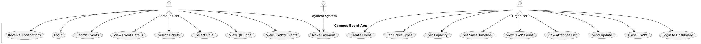
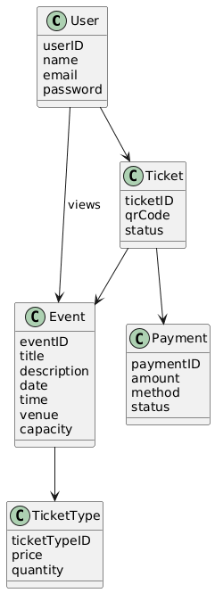
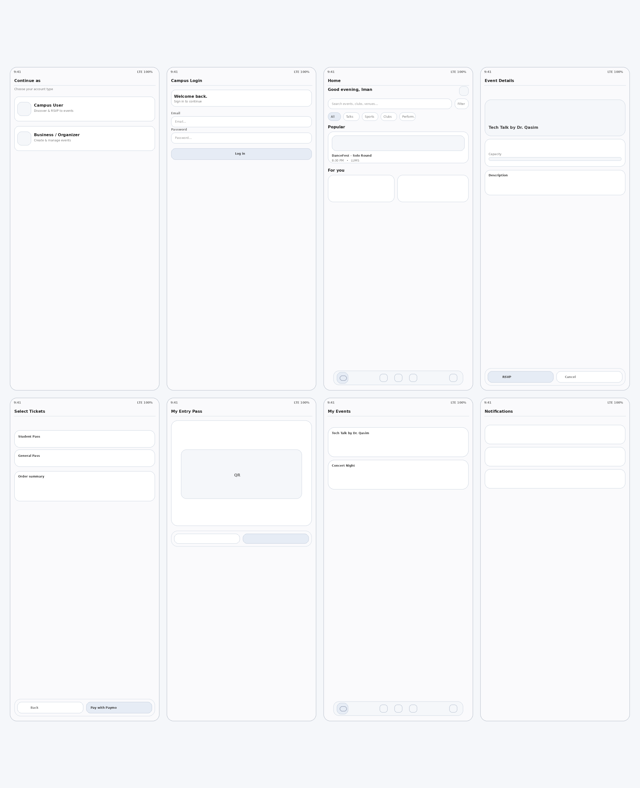
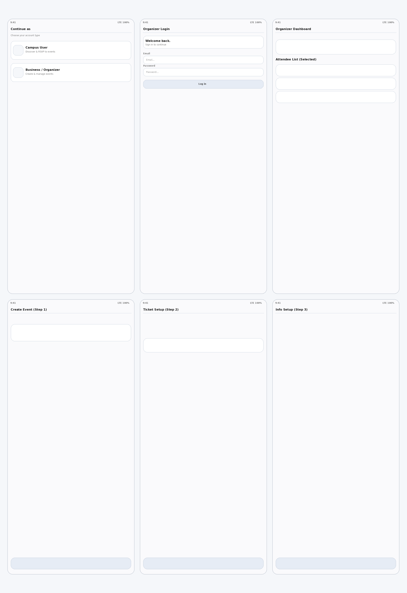

## Team Information
- **Team Name:** rocket

| Name                 | Roll Number | GitHub ID        |
|----------------------|-------------|------------------|
| Mir Huzaifa Gujjar   | 27100368    | MirHuzaifaGujjar |
| Muhammad Mahad Bhatti| 27100245    | madgod2004       |
| Aliza Khan           | 27100240    | 27100240         |
| Eman Anwer Qureshi   | 27100036    | 27100036         |
| Manal Haider         | 27100024    | 27100024         |

--------------------------------------------------------

### TA Project Setup Meeting – February 24, 2026

Discussed repository setup, documentation requirements, backlog management, and design expectations.

#### Attendance
- Mir Huzaifa Gujjar  
- Muhammad Mahad Bhatti  
- Aliza Khan  
- Eman Anwer Qureshi  
- Manal Haider  

**Repository**
- Keep group repo private.
- Add instructors, TF, and TA as collaborators (read access).
- GitHub IDs available on Slack.

**Documentation**
- Create a complete README in Markdown.
- Include meeting minutes, team info (names, roll numbers, GitHub IDs), storyboards, wireframes, UML diagrams, and product backlog.

**Backlog & Workflow**
- Maintain a weekly-updated product backlog.
- Tasks assigned by TA each week.
- Use a Kanban board to track progress.

**Design**
- Create wireframes and full storyboards in Figma.
- Plan complete visual flow and user journey of the app.

---------------------------------------------------------

### Internal Meeting – February 27, 2026

#### Attendance
- Mir Huzaifa Gujjar  
- Muhammad Mahad Bhatti  
- Aliza Khan  
- Eman Anwer Qureshi  
- Manal Haider  

#### Responsibility Allocation – Project Part 2

Tasks were divided during this meeting as follows:

- **Muhammad Mahad Bhatti** – Conducted stakeholder interviews and recorded responses  
- **Aliza Khan** – Conducted stakeholder interviews and recorded responses  
- **Manal Haider** – Designed app wireframes and UI flow in Figma  
- **Eman Anwer Qureshi** – Designed app wireframes and UI flow in Figma  
- **Mir Huzaifa Gujjar** – Created and maintained README documentation, managed Kanban board, and handled GitHub repository setup and requirements  

---

Reviewed stakeholder interview insights and discussed system requirements and recurring operational issues across societies.

#### Interview 1 – Mohsin Ali Bhutto (LUMS Entrepreneurial Society)

**Event Setup Requirements**
- Create event details within the app  
- Ticket sale time scheduling  
- Ticket pricing and capacity management  
- Batch tickets (group ticket bundles)  

**Issues Identified**
- Payment gateway errors on consumer end  
- Manual discount code generation in Excel  
- Brand ambassador codes managed through CSV files  
- Manual tracking of paid vs unpaid users  
- Headcount tracking through Google Forms and payment proofs  
- WhatsApp group used for seller coordination  

---

#### Interview 2 – Eman Anwer Qureshi (PhotoLums)

**Preferences**
- Societies prefer Paymo interface  
- Prefer WhatsApp over in-app chat  

**Issue**
- Communication gap between Paymo and societies  
- Portal stops processing payments when deadlines are extended  

---

#### Interview 3 – User Perspective (Student # 1)

- Ticketwala interface perceived as outdated  
- Ticketly preferred due to account-based event management  
- Clean and structured UI is important  

---

#### Interview 4 – Mahnoor Mirza (PhotoLums)

**Operational Issues**
- Duplicate form submissions without payment  
- Team entries appear row-wise in Excel  
- Manual macros used to group and color-code teams  
- Referral and discount codes mixed in one sheet  
- Need separate tracking for referral and discount codes 

--------------------------------------------------------

### TA Project Setup Meeting – March 1, 2026

#### Attendance
- Mir Huzaifa Gujjar  
- Muhammad Mahad Bhatti  
- Aliza Khan  
- Eman Anwer Qureshi

### Discussion
- We showed the TA our Figma designs
- We showed him the kanban board and explained the progress of tasks
- We showed the recent github changes and updates made to the project
- We also showed him the README file
- He was satisfied with the weekly work we had completed
- He asked us to proceed with the next stage tasks such as making wireframes and CRC cards

--------------------------------------------------------

### Internal Meeting – March 5 , 2026

#### Attendance
- Mir Huzaifa Gujjar  
- Muhammad Mahad Bhatti  
- Aliza Khan  
- Eman Anwer Qureshi  
- Manal Haider

### Discussion
- Divided rest of the project deliverables among all the group members.

-------------------------------------------------------

### TA Project Setup Meeting – March 8, 2026

#### Attendance
- Mir Huzaifa Gujjar  
- Muhammad Mahad Bhatti  
- Aliza Khan  
- Eman Anwer Qureshi

### Discussion
- Updated TA on our progress for Project Part 2 deliverables
- We showed him the wireframes we created and explained the design decisions
- We showed him our updated work on github and he reviewed it during the meeting
- We gave him update on crc cards
- He gave us some suggestions and feedback to improve certain parts of the project
- He wished us good luck for completing the project successfully

--------------------------------------------------------

### Product Backlog – Project Part 2

#### User Stories

| ID | User Story | Priority | Status |
|----|------------|----------|--------|
| 1  | As a user, I want to choose between Campus User and Organizer so that I can access the correct section. | High   | To Do |
| 2  | As a campus user, I want to log in so that I can browse campus events. | High   | To Do |
| 3  | As a campus user, I want to search events by category so that I can find relevant events. | High   | To Do |
| 4  | As a campus user, I want to view event details (date, time, venue, price, capacity) so that I understand the event. | High   | To Do |
| 5  | As a campus user, I want to select ticket types and quantities so that I can purchase tickets. | High   | To Do |
| 6  | As a campus user, I want to pay using Paymo so that I can complete my purchase. | High   | To Do |
| 7  | As a campus user, I want a QR code entry pass so that I can check in at the event. | High   | To Do |
| 8  | As a campus user, I want to view my RSVP’d events so that I can track my registrations. | Medium | To Do |
| 9  | As an organizer, I want to log in to an organizer dashboard so that I can manage my events. | High   | To Do |
| 10 | As an organizer, I want to create events with event details so that users can register. | High   | To Do |
| 11 | As an organizer, I want to set ticket price and quantity so that I can manage ticket sales. | High   | To Do |
| 12 | As an organizer, I want to set event capacity so that tickets are not oversold. | High   | To Do |
| 13 | As an organizer, I want to set sales start and end time so that ticket sales are controlled. | High   | To Do |
| 14 | As an organizer, I want to view RSVP count and attendee list so that I can track attendance. | High   | To Do |
| 15 | As a system, I want to prevent duplicate form submissions without payment so that data remains clean. | High   | To Do |
| 16 | As a system, I want separate tracking for referral and discount codes so that there is no confusion in Excel sheets. | Medium | To Do |
| 17 | As an organizer, I want to send updates to attendees so that they are informed of changes. | Medium | To Do |

------------------------------------------------

### UML Diagrams

### Use Case Diagram

---

### Class Diagram

-----------------------------------------------

### User Interface Mockups and Storyboard Sequences

)

-----------------------------------------------

### Wireframes

